# MetaboCommand

**Metabolic Commerce Multi-Agent Platform** — an AI-agent orchestration dashboard for eCommerce finance and operations teams. Twelve specialized agents across five metabolic systems (Capital Reflex, Revenue Velocity, Inventory Intelligence, Customer Lifetime, Operational Health) surface anomalies, propose actions, and route decisions through role-scoped approval queues with realtime collaboration.

Built on Next.js 16, Supabase (Auth + Postgres + Realtime + Presence), React 19, TypeScript, Tailwind 4, and Recharts.

---

## Screenshots

### Finance Dashboard — Capital Reflex System

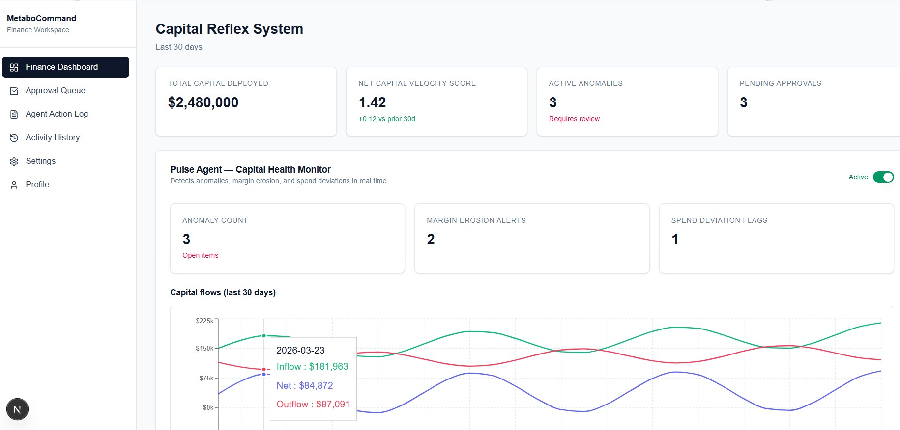

Four KPIs at the top (Total Capital Deployed, Net Capital Velocity Score, Active Anomalies, Pending Approvals) render against live database counts. The Pulse Agent view below is the always-on capital health monitor.

### Pulse Agent — Capital Flows & Vendor Margin Heatmap

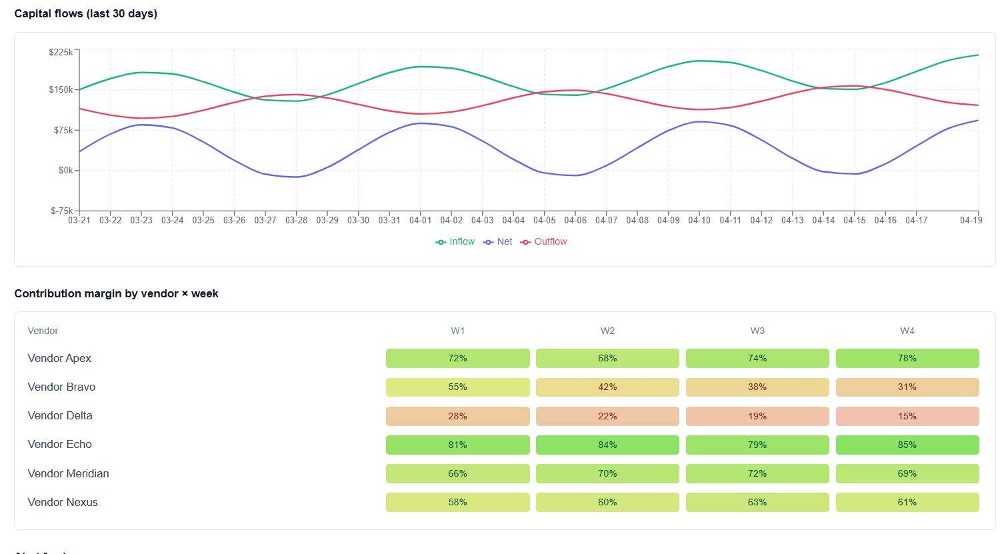

Thirty days of inflow / outflow / net capital with a hover tooltip for any date, plus a color-graded heatmap of contribution margin by vendor × week (Vendor Delta's red cells show a real-world margin-erosion problem).

### Pulse Agent — Alert Feed

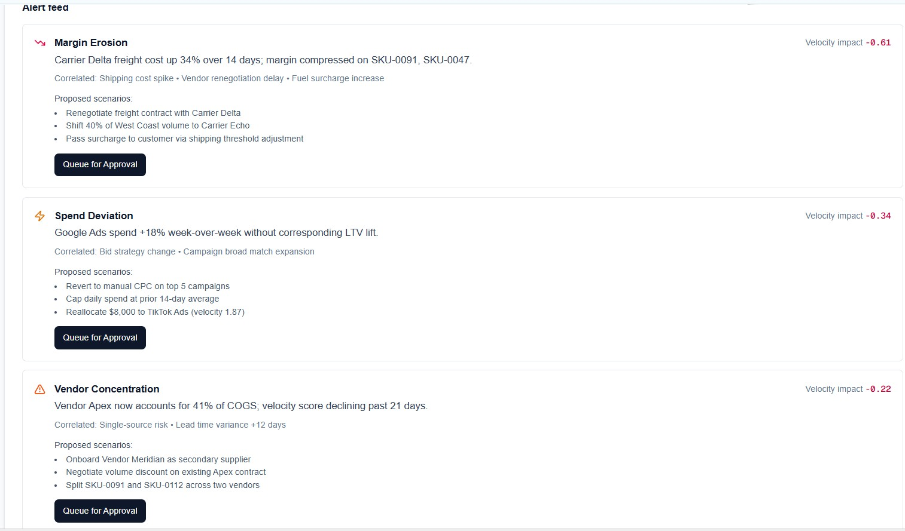

Each anomaly surfaces velocity impact, correlated patterns, and three proposed intervention scenarios. "Queue for Approval" creates a live approval item with a Slack notification.

### Approval Queue — Realtime + Presence

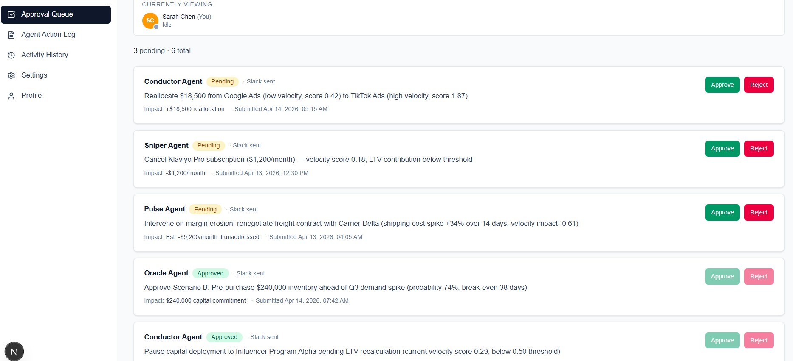

The top bar uses **Supabase Realtime Presence** to show who is viewing the queue, with color-coded activity badges (Idle / Reviewing approval / Approving item / Rejecting item) that broadcast in real time. New items and status changes stream in via `postgres_changes` subscription — no polling, no refresh.

### Agent Action Log — Filters + Expandable Reasoning

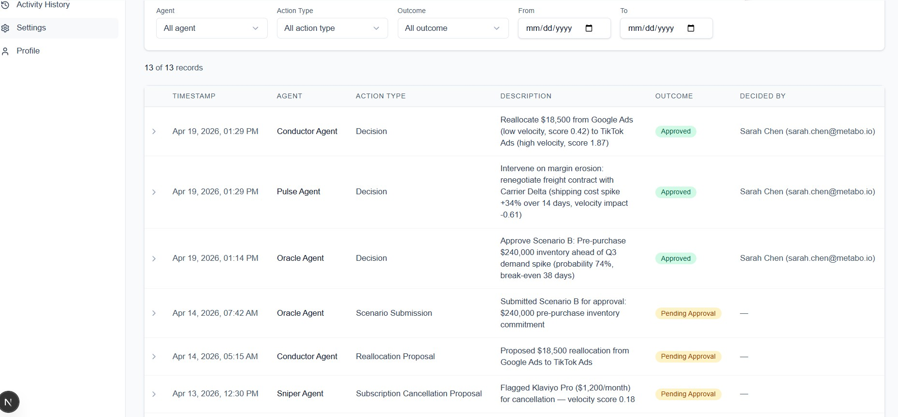

Chronological audit trail of every agent action (proposals, auto-executions, and human decisions). Multi-select filters for Agent, Action Type, and Outcome combine with a date-range picker. Clicking any row reveals the full reasoning summary. The log also subscribes to Realtime — new log rows appear automatically with a row highlight and toast.

### Activity History — Filterable Timeline + CSV Export

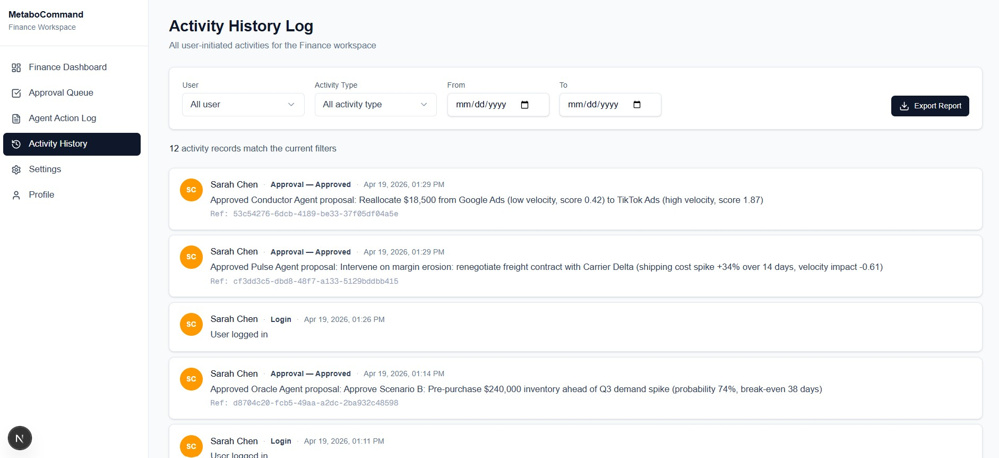

Every user-initiated action (logins, approvals, threshold updates, agent pauses, settings changes) is recorded with UTC timestamp, user identity, and contextual reference. Filters update the timeline instantly; "Export Report" downloads the current filtered set as CSV for offline review.

### Oracle Agent — Scenario Modeling Engine

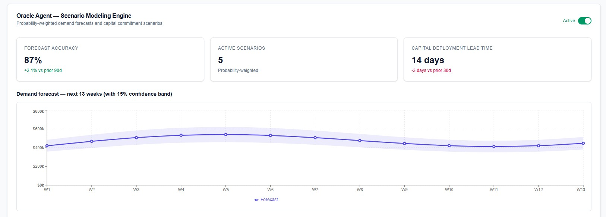

Probability-weighted demand forecasting with a 15% confidence band across a 13-week rolling window. Forecast accuracy, active scenario count, and capital deployment lead time are surfaced as KPIs, while the scenarios table below (not shown) ranks five scenarios by probability with inline "Submit for Approval" actions.

### Sniper Agent — Waste Elimination Reflex

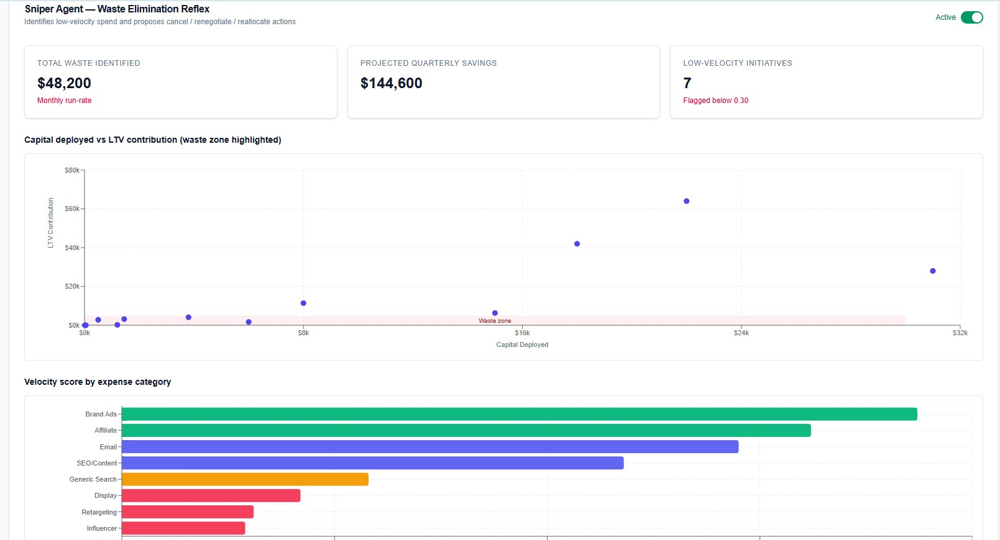

Two visual layers: the scatter plot maps every expense line item by Capital Deployed (x) vs LTV Contribution (y), with a shaded red "waste zone" on the low-spend / low-LTV quadrant. Below it, the velocity bar chart color-codes categories (green ≥1.5, indigo ≥1.0, amber ≥0.5, rose &lt;0.5). Items under $500/month auto-execute; larger items queue for CFO approval.

### Conductor Agent — Capital Orchestration

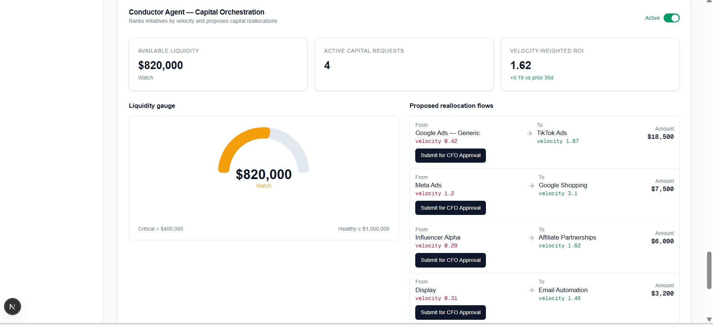

Liquidity gauge with critical / watch / healthy thresholds, alongside proposed capital reallocation flows. Each flow shows velocity deltas between source and destination channels and can be one-click submitted for CFO approval.

---

## Operations Dashboard

### Operations Command Center — Overview

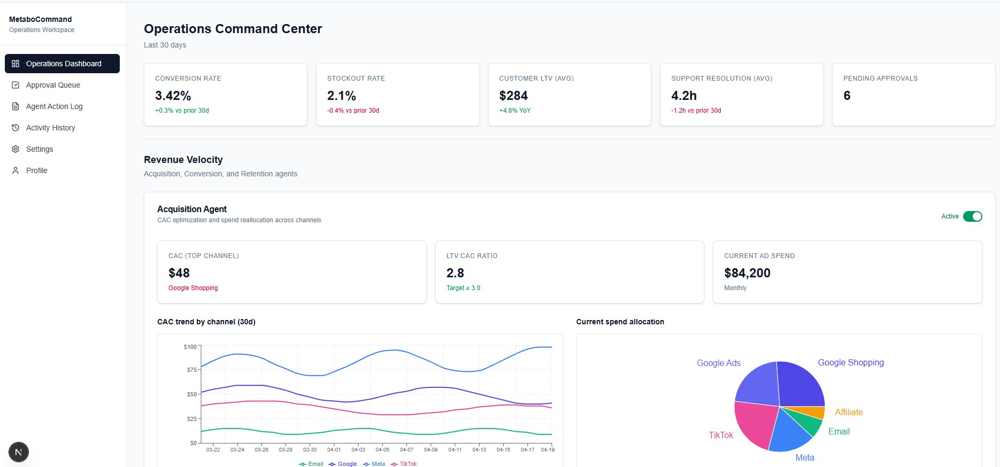

Five-card KPI bar (Conversion Rate, Stockout Rate, Customer LTV, Support Resolution, Pending Approvals) plus section-grouped agent panels. James (Operational Lead) lands here on login; RLS ensures he sees only Operations-scoped approval items, log records, and activity history.

### Acquisition Agent — Revenue Velocity

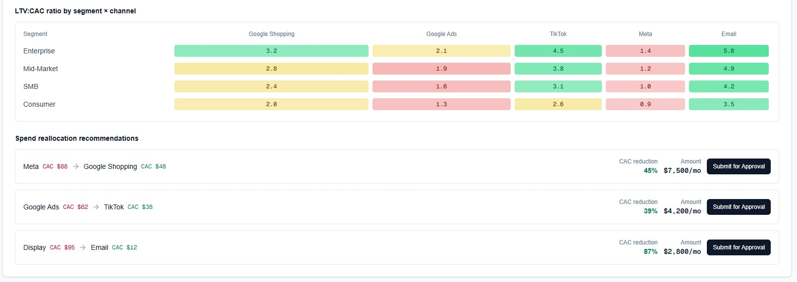

LTV:CAC ratio heatmap by customer segment × acquisition channel (green = healthy, amber = watch, red = losing money), with auto-generated spend reallocation recommendations below. Each recommendation quantifies the CAC reduction and monthly dollar amount, submittable for approval with one click.

### Conversion Agent — Funnel + A/B Orchestration

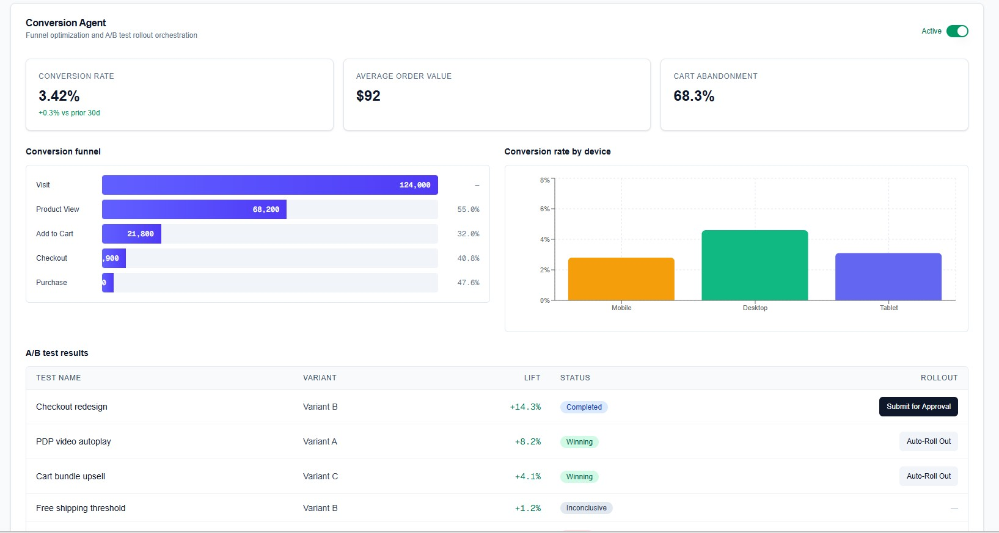

Inline funnel visualization with step-to-step conversion percentages, color-coded conversion rate by device, and A/B test results with split routing: tests under a 10% lift threshold auto-roll out to 100% traffic; larger lifts require approval.

### Retention Agent — Churn & Win-back

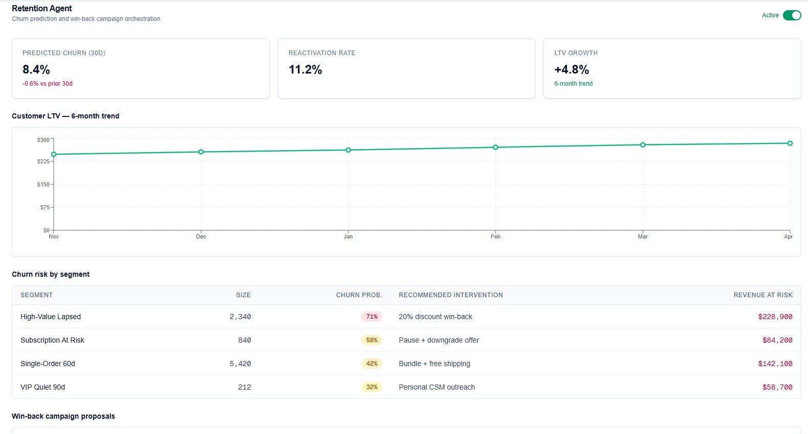

Six-month LTV trend plus churn risk segmentation with intervention recommendations and dollar revenue at risk. Clicking through to win-back campaign proposals (not shown) submits real approval items for the Operational Lead to approve.

### Demand Prophet Agent — Inventory Intelligence

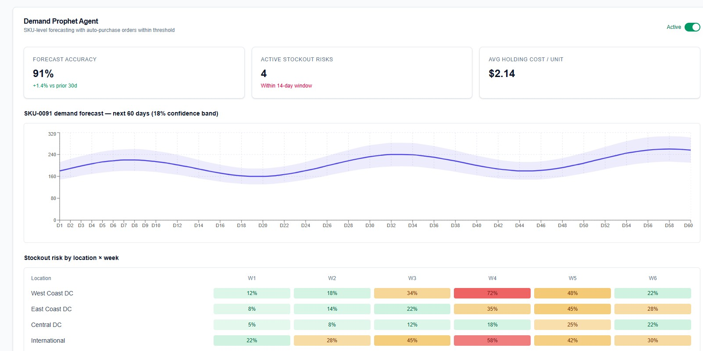

60-day SKU-level demand forecast with an 18% confidence band, paired with a stockout risk heatmap across distribution centers and weeks. Warehouses flagged amber or red trigger auto-generated POs (auto-execute under $10,000, approval-required above).

### Logistics Conductor Agent — Carrier & Route Optimization

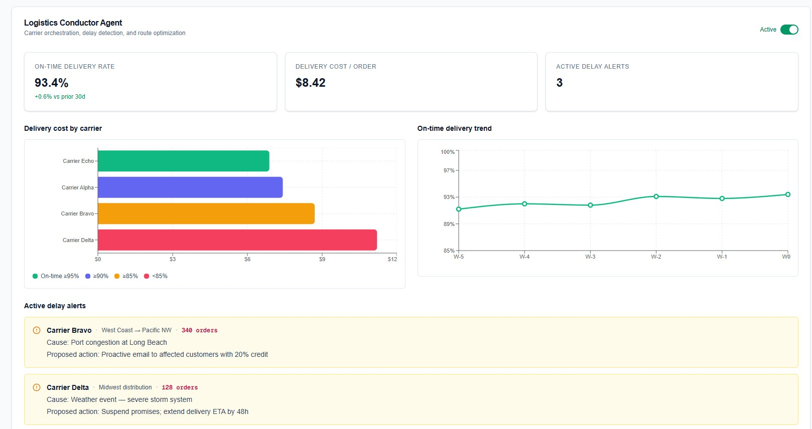

Carrier cost bars color-coded by on-time rate (green ≥95%, rose &lt;85%), on-time trend line, and active delay alerts with proposed proactive actions. Route optimization proposals quantify annual savings and on-time improvement percentages.

### Support Reflex Agent — Customer Lifetime

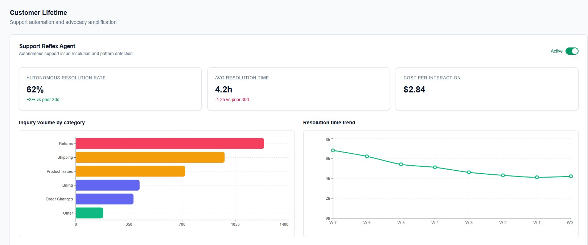

Inquiry volume bars color-coded by severity (rose ≥1000, amber 500-999, indigo 300-499, green &lt;300), 8-week resolution time trend, and recurring issue patterns with auto-generated process improvements submittable for approval.

### Advocacy Agent — Review & Referral Amplification

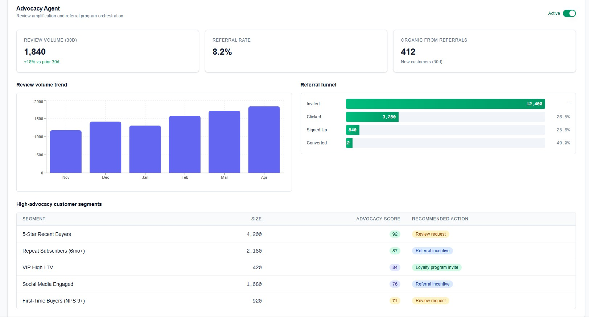

Six-month review volume trend, inline referral funnel with step-to-step conversion percentages, and a high-advocacy segment table ranking customer cohorts by advocacy score with recommended actions (Review request / Referral incentive / Loyalty program invite).

### Harmony Agent — Operational Health + Operating Mode Toggle

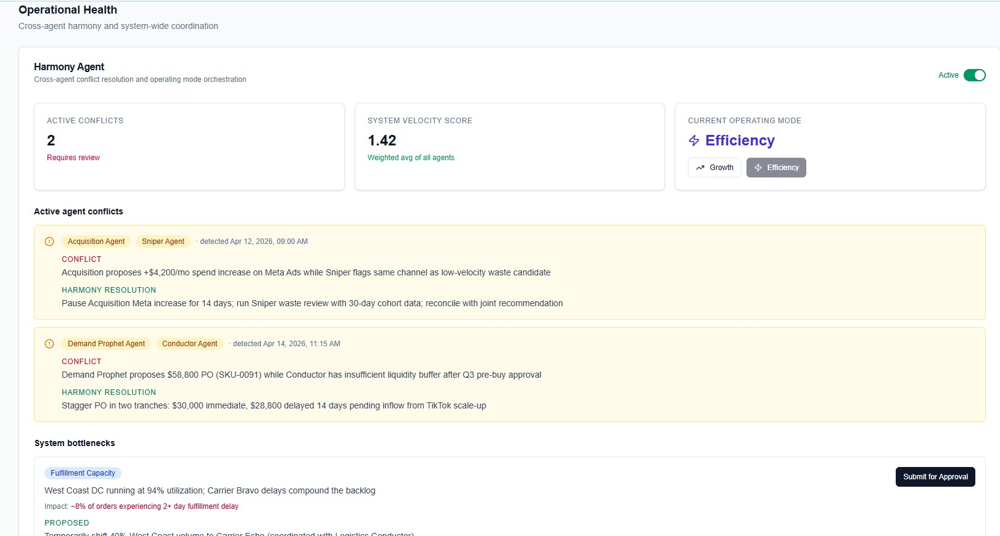

The system-wide coordinator. Two KPI cards plus a **Growth / Efficiency operating mode toggle** (confirmed via modal, broadcast via Realtime so all tabs sync). The Active agent conflicts feed shows cross-agent disagreements with Harmony's resolution recommendation; the System bottlenecks feed surfaces capacity issues with Submit-for-Approval actions.

---

## What works end-to-end

After Phase 2b, the app is **feature-complete against the requirements spec** except for live data integrations and agent pause persistence (both explicitly deferred):

- **Auth + role routing** — Supabase email/password; CFO lands on Finance Dashboard, Operational Lead lands on Operations Dashboard.
- **Finance Dashboard** with four fully-built Capital Reflex agents:
  - **Pulse Agent** — KPI cards, capital flows line chart, vendor margin heatmap, alert feed with "Queue for Approval"
  - **Oracle Agent** — demand forecast with 15% confidence band, probability-weighted scenario stack, 5-scenario decision table
  - **Sniper Agent** — expense scatter plot with waste zone overlay, velocity bar chart, waste proposals with Auto-Execute / Submit-for-Approval split
  - **Conductor Agent** — liquidity gauge, reallocation flows, priority matrix for 7 active initiatives
- **Operations Dashboard** with all eight agents across four panels:
  - **Acquisition Agent** — CAC trend, LTV:CAC heatmap, spend pie, reallocation recommendations
  - **Conversion Agent** — inline funnel, device breakdown, A/B test table with Auto-Rollout vs Submit routing
  - **Retention Agent** — LTV trend, churn risk segments, win-back campaign proposals
  - **Demand Prophet Agent** — SKU forecast with confidence band, stockout heatmap, auto-PO table with threshold
  - **Logistics Conductor Agent** — carrier bars color-coded by on-time rate, on-time trend, delay alerts, route optimizations
  - **Support Reflex Agent** — inquiry volume bars, resolution time trend, recurring issue patterns with process improvements
  - **Advocacy Agent** — review volume trend, referral funnel, high-advocacy segment table
  - **Harmony Agent** — agent conflict feed, Growth/Efficiency operating mode toggle (confirmation modal + Realtime broadcast), system bottleneck feed
- **Approval Queue** — Realtime subscription + Presence + four activity status badges (Idle / Reviewing / Approving / Rejecting) + 60s idle timeout + Slack webhook notifications + RLS-enforced role scoping
- **Agent Action Log** — Realtime + Presence (Idle / Reviewing log / Filtering logs) + three-filter combination + expandable reasoning rows
- **Activity History Log** — multi-select filters + date range + paginated load-more + CSV export + role scoping
- **Settings** — Data Source cards, editable Agent Threshold table, Slack Integration with Test Connection
- **Profile** — read-only account info, password change, notification preferences toggles (persisted to JSONB)
- **Seed data** — 12 agents, 14 approval items, 22 agent log records, 14 activity records, all matching the requirements spec exactly

## Architecture

```
                                     Browser (Next.js client)
                                     │
         ┌───────────────────────────┴───────────────────────────┐
         │                                                        │
     Server Components                                        Client Components
     (RSC + Tailwind)                                          - Recharts
      │                                                        - Realtime subscriptions
      │                                                        - Presence channels
      │                                                        - Activity-status broadcasts
      ▼                                                         │
  Route handlers                                                ▼
  /api/approvals/submit                             Supabase JS (anon key + RLS)
  /api/approvals/decide                             - postgres_changes on approval_items
  - Zod validation                                  - postgres_changes on agent_action_log
  - Role check                                      - presence channel per page per role
  - Insert + Slack webhook
  - Activity log write
      │
      ▼
  Supabase Postgres
  - profiles (role)      ──> enforced by RLS policies
  - agents                   scoped via current_user_role()
  - approval_items           function in security definer context
  - agent_action_log
  - activity_history
  - slack_settings
```

## Tech stack

| Layer | Choice | Why |
|---|---|---|
| Framework | Next.js 16 (App Router, Turbopack) | Server Components, strong Supabase SSR integration, fast dev builds |
| Language | TypeScript (strict) | Type safety across the DB contract |
| Database / Auth | Supabase (Postgres + Auth + Realtime + Presence) | Required by the spec for realtime + presence |
| Styling | Tailwind CSS 4 | Consistent design system, zero CSS files |
| UI primitives | Radix UI + small local components | Accessible dropdowns, switches, checkboxes |
| Charts | Recharts | Covers every chart type in spec (line, area, scatter, bar, radial, heatmap table) |
| Validation | Zod | API payload validation |
| Icons | Lucide React | Consistent icon set |

## Project structure

```
metabocommand/
├── src/
│   ├── app/
│   │   ├── (dashboard)/              # auth-gated layout
│   │   │   ├── finance/              # Capital Reflex dashboard
│   │   │   │   ├── page.tsx
│   │   │   │   ├── pulse-agent-view.tsx
│   │   │   │   ├── oracle-agent-view.tsx
│   │   │   │   ├── sniper-agent-view.tsx
│   │   │   │   └── conductor-agent-view.tsx
│   │   │   ├── operations/           # placeholder
│   │   │   ├── approvals/            # Realtime + Presence + activity status
│   │   │   │   ├── page.tsx
│   │   │   │   ├── approval-queue.tsx
│   │   │   │   └── presence-bar.tsx
│   │   │   ├── agent-log/            # Realtime + Presence + filters
│   │   │   │   ├── page.tsx
│   │   │   │   ├── agent-log-view.tsx
│   │   │   │   └── log-presence-bar.tsx
│   │   │   ├── activity/             # Filters + CSV export
│   │   │   │   ├── page.tsx
│   │   │   │   └── activity-view.tsx
│   │   │   ├── settings/             # placeholder
│   │   │   ├── profile/              # read-only
│   │   │   └── layout.tsx            # sidebar + auth guard
│   │   ├── api/approvals/
│   │   │   ├── submit/route.ts       # create approval + Slack + log
│   │   │   └── decide/route.ts       # approve/reject + Slack + activity + log
│   │   ├── login/                    # email/password sign-in
│   │   ├── role-not-assigned/
│   │   ├── layout.tsx
│   │   └── page.tsx                  # role-based redirect
│   ├── components/
│   │   ├── ui/                       # Button, Card, Badge, Switch, Input, CheckboxList
│   │   ├── sidebar.tsx
│   │   ├── kpi-card.tsx
│   │   └── placeholder-page.tsx
│   ├── lib/
│   │   ├── supabase/                 # client / server / middleware / types
│   │   ├── slack.ts                  # webhook payload builder
│   │   ├── csv.ts                    # RFC-4180 CSV export
│   │   ├── dummy-data.ts             # deterministic seeded chart data
│   │   └── utils.ts                  # cn, formatters, avatar helpers
│   └── middleware.ts                 # session refresh + auth redirect
├── supabase/migrations/
│   ├── 0001_schema.sql               # tables, types, RLS, realtime
│   └── 0002_seed.sql                 # all seed records
├── docs/screenshots/                 # README imagery
├── .env.example
└── README.md
```

---

## Getting started

### 1. Prerequisites

- Node.js 20+ (tested on 24.14)
- A Supabase project (free tier is fine)

### 2. Clone and install

```bash
git clone https://github.com/zan-maker/metabocommand.git
cd metabocommand
npm install
```

### 3. Environment

Copy `.env.example` to `.env.local` and fill in your Supabase credentials:

```bash
cp .env.example .env.local
```

```dotenv
NEXT_PUBLIC_SUPABASE_URL=https://your-project.supabase.co
NEXT_PUBLIC_SUPABASE_ANON_KEY=your-anon-key
SUPABASE_SERVICE_ROLE_KEY=your-service-role-key

# Optional; can be configured later via SQL
SLACK_FINANCE_WEBHOOK_URL=
SLACK_OPERATIONS_WEBHOOK_URL=
```

### 4. Run the schema migration

Open your Supabase Dashboard → **SQL Editor** → **New query**, paste the full contents of `supabase/migrations/0001_schema.sql`, and click **Run**.

This creates all tables, enum types, RLS policies, the `handle_new_user` trigger, and adds `approval_items` + `agent_action_log` to the `supabase_realtime` publication.

### 5. Create the two test users

In Supabase → **Authentication** → **Users** → **Add user**, with **Auto Confirm User** checked:

| Email | Role |
|---|---|
| sarah.chen@metabo.io | finance |
| james.okafor@metabo.io | operations |

Then run this in the SQL Editor to set roles:

```sql
update public.profiles set role = 'finance',    display_name = 'Sarah Chen'   where email = 'sarah.chen@metabo.io';
update public.profiles set role = 'operations', display_name = 'James Okafor' where email = 'james.okafor@metabo.io';
```

### 6. Seed the data

Paste and run `supabase/migrations/0002_seed.sql` in the SQL Editor. Expected counts after:

| Table | Row count |
|---|---|
| `agents` | 12 |
| `approval_items` | 14 (6 Finance + 8 Operations) |
| `agent_action_log` | 22 (10 Finance + 12 Operations) |
| `activity_history` | 14 (7 Finance + 7 Operations) |

### 7. (Optional) Configure Slack webhooks

```sql
update public.slack_settings set webhook_url = 'https://hooks.slack.com/services/...' where queue = 'finance';
update public.slack_settings set webhook_url = 'https://hooks.slack.com/services/...' where queue = 'operations';
```

Without webhooks, approvals still work — Slack notifications are just skipped with `slack_notified = false`.

### 8. Run the dev server

```bash
npm run dev
```

Open [http://localhost:3000](http://localhost:3000) and sign in as Sarah or James.

---

## Multi-tab demo — see Realtime + Presence live

1. Sign in as Sarah in two browser tabs (or one regular + one incognito).
2. Navigate both to `/approvals`.
3. Hover an approval item in tab 1 — watch Sarah's badge turn **blue ("Reviewing approval")** in tab 2 within a second.
4. Click Approve in tab 1 — the row updates in tab 2 instantly, badge turns **green → grey** as the action completes, and a toast appears.
5. Close tab 1 — Sarah's presence entry disappears from tab 2 within a few seconds.

The same pattern works on `/agent-log` with its own activity statuses (Idle / Reviewing log / Filtering logs).

---

## Security

- **RLS is enforced on every table.** Finance-role users can only read and write Finance-scoped rows; Operations users only Operations. `profiles` is readable by all authenticated users so Presence can display names and avatars.
- **Service role key** is server-only, used for admin operations via `createServiceClient()`. Never sent to the browser.
- **Anon key** is safe to expose in the client — RLS does the gatekeeping.
- **Approval actions** validate the user's role matches the approval item's queue before allowing the state transition. Already-decided items cannot be re-decided (409 Conflict).
- **Slack webhooks** are stored in the database (not env) so they can be rotated without redeploy.

---

## Out of scope for this release

- **Live Shopify / QuickBooks integrations** — dummy data only per spec section 7
- **Agent pause/resume persistence** — the Active/Paused toggle is local-state only; a trivial follow-up to write to `agents.is_active`
- **Automated test suite** — Vitest for utilities + Playwright for the two-tab Realtime/Presence demo
- **Sniper auto-execute logging to the server** — currently UI-only; a follow-up endpoint would write to `agent_action_log` as "Auto-Executed"

---

## Requirements coverage

Full spec at [`../MetaboCommand.md`](../MetaboCommand.md). Sections implemented:

- [x] §3.2 Authentication — login + role redirect
- [x] §3.3 Global Navigation — role-aware sidebar
- [x] §3.4.1 Dashboard Header + KPI bar
- [x] §3.4.2 Pulse Agent
- [x] §3.4.3 Oracle Agent
- [x] §3.4.4 Sniper Agent
- [x] §3.4.5 Conductor Agent
- [x] §3.4.6 Finance Approval Queue (Realtime, Presence, activity status)
- [x] §3.5.1 Operations Dashboard Header + KPI bar
- [x] §3.5.2 Revenue Velocity panel (Acquisition, Conversion, Retention)
- [x] §3.5.3 Inventory Intelligence panel (Demand Prophet, Logistics Conductor)
- [x] §3.5.4 Customer Lifetime panel (Support Reflex, Advocacy)
- [x] §3.5.5 Operational Health panel (Harmony)
- [x] §3.5.6 Operations Approval Queue (shares Approval Queue component, RLS-scoped)
- [x] §3.6 Agent Action Log (Realtime, Presence, filters, expandable rows)
- [x] §3.7 Activity History Log (filters, CSV export, pagination)
- [x] §3.8 Settings UI (Data Source cards, Threshold table, Slack config with Test Connection)
- [x] §3.9 User Profile (read-only account, password change, notification preferences)
- [x] §4.1 RBAC (enforced via RLS)
- [x] §4.2 Approval workflow (auto-execute threshold + Slack)
- [x] §4.3 Capital Velocity Score formula (displayed throughout)
- [x] §4.4 Operating Mode (Growth / Efficiency toggle with confirmation + Realtime)
- [x] §4.7 Seed data for queues + logs
- [x] §4.8 Realtime subscription rules
- [x] §4.9 Presence rules
- [x] §4.10 Activity status rules
- [x] §4.11 Activity History tracked types + seed
- [ ] §4.6 Agent pause persistence — UI-only currently; trivial follow-up

---

## License

MIT. See [LICENSE](LICENSE).
